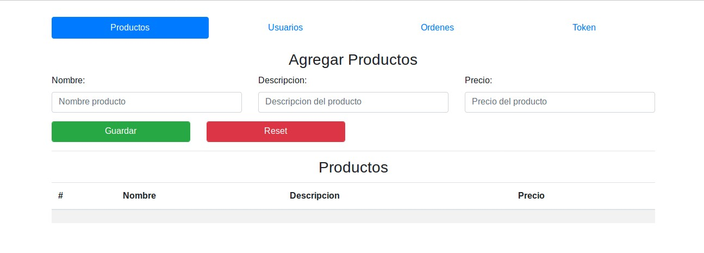

:sourcedir: ../src/main/java

= Aplicación de PayU

== Introducción
[.text-left]
Nuestra aplicación cuanta con implementación de JPA hibernate con el API de PayU, con fines prácticos se realizo este proyecto, se ralizo una pagina en el cual se podrían registrar productos y usuarios, en el apartado de ordenes apartir de los usuarios y productos registrados se generaba la orden y se mandaba un post al servidor con los datos del usuario y los productos, el servidor nos contestaba y en base en eso se mostraba una nueva pantalla que tenia dos posibles resultados, éxito o error. En la siguiente pestaña se realiza un Token en el cual con los datos de un usuario y una tarjeta de crédito se envía una petición al servidor, el cual dependiendo de que respondía se mostraba una pantalla en el cual decía éxito y nuestro Token o en el otro caso una de error.

== Vista principal
[.thumb]
