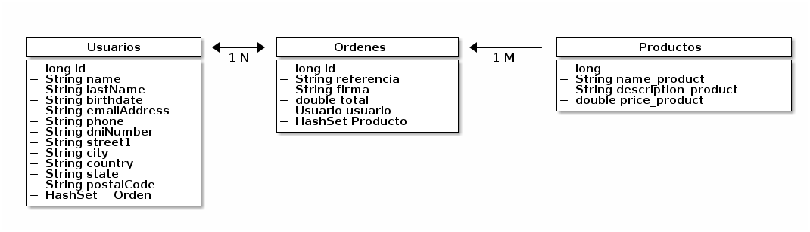

:sourcedir: ../src/main/java
== Modelo de datos
Utilizamos tres tablas en la base de datos las cuales tienen relaciones entre si, ya que para mandar la petición de pago necesitamos los datos de cada una de estas tablas. Los datos de los usuarios se necesitan para toda la información relacionada con el pago por medio de la tarjeta de crédito, dado esto y la información dada por la API
de PayU, para tener todo sistematizado y llevar un orden se tiene una relación de uno a muchos en las ordenes
con el usuario debido a que un usuario puede tener muchas ordenes y por parte de las ordenes
una orden tiene varios productos.

